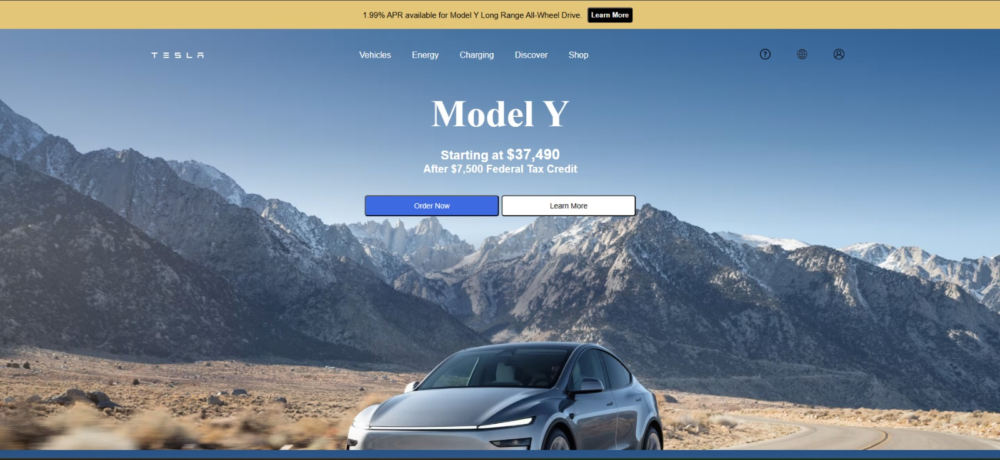
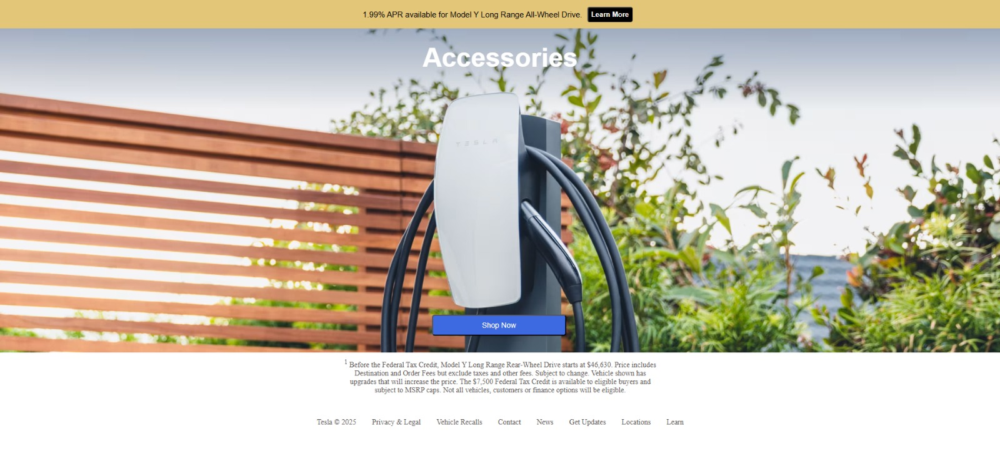
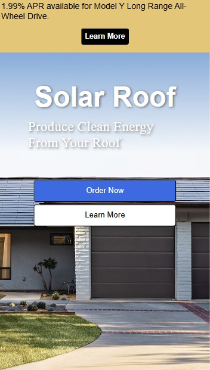
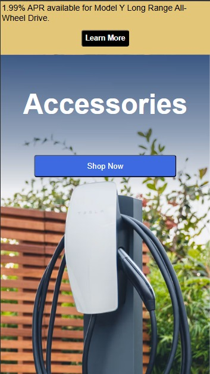

# ⚡ Tesla Website Clone 🚗

> A fully responsive **Tesla.com clone** built using **HTML & CSS** — my first complete website project created entirely from scratch!

---

## 🌟 Features

- ✅ **Responsive Design** — works on all screen sizes  
- ✅ **Pixel-perfect layout** inspired by [tesla.com](https://www.tesla.com)  
- ✅ **Built from scratch** using just HTML5 & CSS3  
- ✅ **Modern CSS techniques** — Flexbox, Media Queries  
- ✅ **Clean, readable code** and organized folder structure

---

## 📸 Preview

### 💻 Desktop Views

| Desktop View 1 | Desktop View 2 |
|:--------------:|:--------------:|
|  |  |

---

### 📱 Mobile Views

| Mobile View 1 | Mobile View 2 |
|:-------------:|:-------------:|
|  |  |

---

## 🛠️ Tech Stack

- **HTML5** — semantic structure  
- **CSS3** — layout, styling, responsiveness  
- No JavaScript or frameworks — pure handcrafted HTML/CSS 🚀

---

## 🚀 Getting Started

To run this project locally:

```bash
git clone https://github.com/devaayan/Tesla-Clone.git
cd Tesla-Clone
